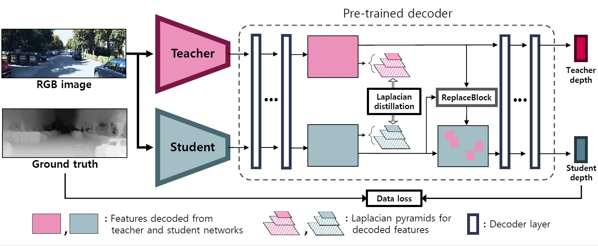
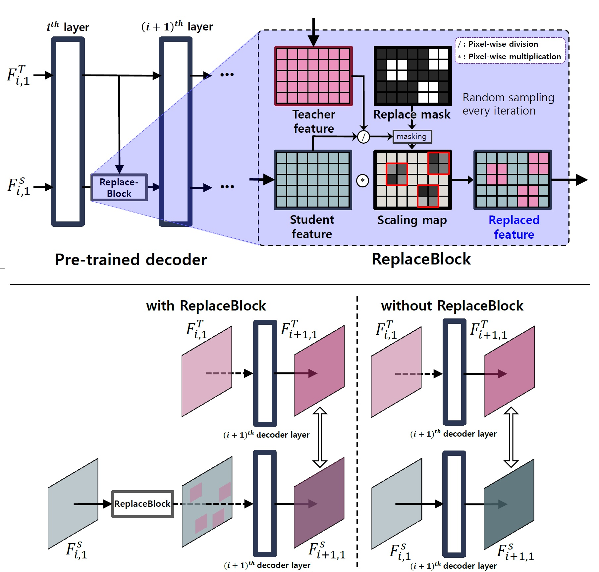
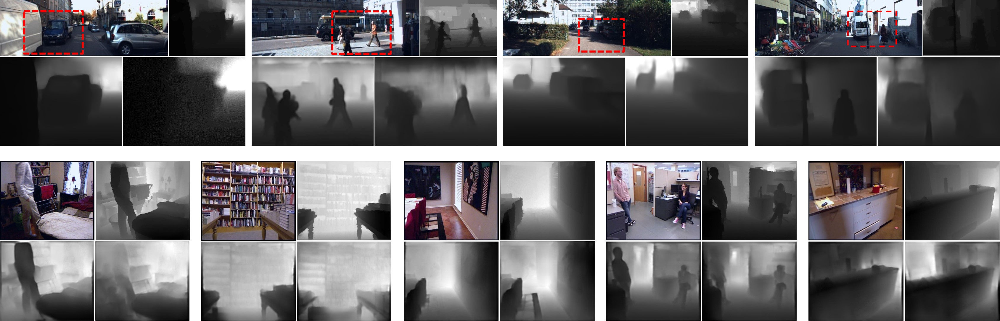
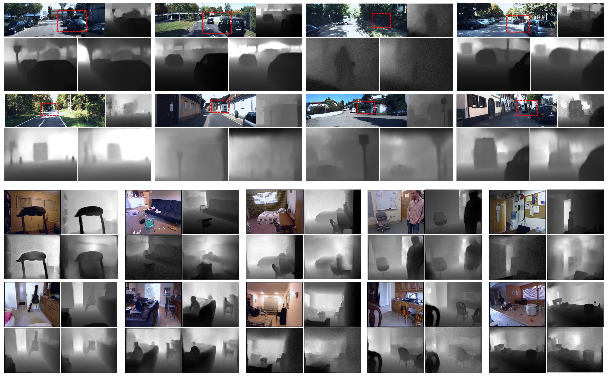

# Lap_Rep_KD_Depth
Decomposition and Replacement: Spatial Knowledge Distillation for Monocular Depth Estimation

This repository is an oiffical Pytorch implementation of the paper [**"Decomposition and Replacement: Spatial Knowledge Distillation for Monocular Depth Estimation"**](https://www.sciencedirect.com/science/article/abs/pii/S1047320322000669)

Minsoo Song and [Wonjun Kim*](https://sites.google.com/view/dcvl)  
Journal of Visual Communication and Image Representation (JVCIR)


The proposed method is to transfer the rich knowledge of the scene depth, which is well encoded through the teacher network, to the student network in a structured way by decomposing it into the global context and local details.

<p align="center">

</p>

We also propose a new guidance concept for knowledge distillation, so-called **ReplaceBlock**, which replaces blocks randomly selected in the decoded feature of the student network with those of the teacher network. Our ReplaceBlock gives a smoothing effect in learning the feature distribution of the teacher network by considering the spatial contiguity in the feature space.

## Enviornments

* Python >= 3.7
* Pytorch >= 1.6.0
* Ubuntu 16.04
* CUDA 10.2
* cuDNN (if CUDA available)

some other packages: geffnet, path, blessings, progressbar, tqdm

## Pretrained models
We proivde pre-trained MobileNetV2 and ResNet18 weights for KITTI and NYUV2 datasets. These models are trained on 4x Titan X GPUs. This is a reimplementation and the quantitative results are slightly different from our original paper.
* [MobileNetV2_encoder_pretrained_with_kitti](https://1drv.ms/u/s!An562j_-CwpPgjWOAYq9lJc-QBdt?e=GuLfOI)
* [Decoder_pretrained_with_kitti](https://1drv.ms/u/s!An562j_-CwpPgjPyqk-_WOq6nx-X?e=HmH8cV)

   |Method          | speed  |  a1   |  a2   |  a3   | Abs Rel | Sq Rel | log10 | RMSE  | RMSE log |
   | :---:          | :---:  | :---: | :---: | :---: | :-----: | :----: | :---: | :---: | :------: |
   |Teacher         | 47 fps  | 0.941 | 0.990 | 0.998 |  0.072  | 0.284  | 0.030 | 2.760 |  0.109   |
   |baseline        | 110 fps | 0.908 | 0.979 | 0.993 |  0.088  | 0.396  | 0.038 | 3.294 |  0.135   |
   |with Spatial-KD | 110 fps | 0.928 | 0.987 | 0.997 |  0.077  | 0.339  | 0.033 | 3.084 |  0.118   |

* [ResNet18_encoder_pretrained_with_nyu](https://1drv.ms/u/s!An562j_-CwpPgjTGiOynIUxLpcoc?e=FS0164)
* [Decoder_pretrained_with_nyu](https://1drv.ms/u/s!An562j_-CwpPgjKEfNNaw4s4LZsw?e=zP2b0b)

   |Method          | speed  |  a1   |  a2   |  a3   | Abs Rel | Sq Rel | log10 | RMSE  | RMSE log |
   | :---:          | :---:  | :---: | :---: | :---: | :-----: | :----: | :---: | :---: | :------: |
   |Teacher         | 47 fps  | 0.862 | 0.978 | 0.994 |  0.120  | 0.078  | 0.050 | 0.431 |  0.151   |
   |baseline        | 166 fps | 0.785 | 0.945 | 0.983 |  0.165  | 0.131  | 0.068 | 0.533 |  0.193   |
   |with Spatial-KD | 166 fps | 0.806 | 0.958 | 0.988 |  0.155  | 0.117  | 0.063 | 0.500 |  0.185   |

## Dataset Preparation
We referred to [BTS](https://github.com/cogaplex-bts/bts) in the data preparation process.

### KITTI
**1. [Official ground truth](http://www.cvlibs.net/download.php?file=data_depth_annotated.zip)**  
   * Download official KITTI ground truth on the link and make KITTI dataset directory.
```bash
    $ cd ./datasets
    $ mkdir KITTI && cd KITTI
    $ mv ~/Downloads/data_depth_annotated.zip ./datasets/KITTI
    $ unzip data_depth_annotated.zip
```
**2. Raw dataset**  
   * Construct raw KITTI dataset using following commands.
```bash
    $ mv ./datasets/kitti_archives_to_download.txt ./datasets/KITTI
    $ cd ./datasets/KITTI
    $ aria2c -x 16 -i ./kitti_archives_to_download.txt
    $ parallel unzip ::: *.zip
```
KITTI data structures are should be organized as below:                           

    |-- datasets
      |-- KITTI
         |-- data_depth_annotated  
            |-- 2011_xx_xx_drive_xxxx_sync
               |-- proj_depth  
                  |-- groundtruth            # official G.T folder
            |-- ... (all drives of all days in the raw KITTI)  
         |-- 2011_09_26                      # raw RGB data folder  
            |-- 2011_09_26_drive_xxxx_sync
         |-- 2011_09_29
         |-- ... (all days in the raw KITTI)
         
 ### NYU Depth V2
**1. Training set**  
    Make NYU dataset directory
```bash
    $ cd ./datasets
    $ mkdir NYU_Depth_V2 && cd NYU_Depth_V2
```
* Constructing training data using following steps :
    * Download Raw NYU Depth V2 dataset (450GB) from this **[Link](http://horatio.cs.nyu.edu/mit/silberman/nyu_depth_v2/nyu_depth_v2_raw.zip).**  
    * Extract the raw dataset into '`./datasets/NYU_Depth_V2`'  
    (It should make **'`./datasets/NYU_Depth_V2/raw/....`'**).  
    * Run './datasets/sync_project_frames_multi_threads.m' to get synchronized data. (need Matlab)  
    (It shoud make **'`./datasets/NYU_Depth_V2/sync/....`'**).  
* Or, you can directly download whole 'sync' folder from our Google drive **[Link](https://drive.google.com/file/d/106oW6C7dfLHQYCNXZw9pn9q61ewNIZV1/view?usp=sharing)** into **'`./datasets/NYU_Depth_V2/`'**

**2. Testing set**  
    Download official nyu_depth_v2_labeled.mat and extract image files from the mat file.
```bash
    $ cd ./datasets
    ## Download official labled NYU_Depth_V2 mat file
    $ wget http://horatio.cs.nyu.edu/mit/silberman/nyu_depth_v2/nyu_depth_v2_labeled.mat
    ## Extract image files from the mat file
    $ python extract_official_train_test_set_from_mat.py nyu_depth_v2_labeled.mat splits.mat ./NYU_Depth_V2/official_splits/
```        

## Evaluation
Make sure you downloaded the pre-trained model and placed it in the './pretrained/' directory before running the evaluation code.
* Evaluation Command Line:
```bash
# Running evaluation using a pre-trained models
## KITTI
python eval.py --batch_size 1 --gpu_num 0 --student --evaluate --dataset KITTI --model MobileNetV2 --data_path      /your/workspace/KITTI/ --model_dir ./MobileNet_encoder_pretrained_KITTI.pkl --decoder_dir ./decoder_pretrained_KITTI.pkl
## NYU
python eval.py --batch_size 1 --gpu_num 0 --student --evaluate  --dataset NYU --model ResNet18 --data_path /your/workspace/NYU_Depth_V2/official_splits/test --model_dir ./ResNet18_encoder_pretrained_NYU.pkl --decoder_dir ./decoder_pretrained_NYU.pkl
    
## Training
Single training (without spatial knowledge distillation)
```bash
# 4 gpus setting
# KITTI
OMP_NUM_THREADS=1 python train.py --distributed --batch_size 80 --dataset KITTI --data_path /your/workspace/KITTI --mode Single_training --epochs 50 --model MobileNetV2 --gpu_num 0,1,2,3
# NYU
OMP_NUM_THREADS=1 python train.py --distributed --batch_size 80 --dataset NYU --data_path /your/workspace/NYU_Depth_V2/sync --mode Single_training --epochs 50 --model MobileNetV2 --gpu_num 0,1,2,3
```

Student training (with spatial knowledge distillation)
- We provide pre-trained teacher network weights (ResNext101)
* [ResNext_single_encoder_pretrained_KITTI](https://1drv.ms/u/s!An562j_-CwpPgjln_DxZqOyj-zW7?e=JGteSd)
* [ResNext_single_decoder_pretrained_KITTI](https://1drv.ms/u/s!An562j_-CwpPgjdbT6hP9GQKH_XZ?e=KScde2)
* [ResNext_single_encoder_pretrained_NYU](https://1drv.ms/u/s!An562j_-CwpPgjgwf2xQNc-Y553M?e=H5ZBMx)
* [ResNext_single_decoder_pretrained_NYU](https://1drv.ms/u/s!An562j_-CwpPgjbgcp1pGwMylWSD?e=oj8nBn)

```bash
# 4 gpus setting
# KITTI
OMP_NUM_THREADS=1 python train.py --distributed --batch_size 80 --dataset KITTI --data_path /your/workspace/KITTI --model_encoder_dir ./ResNext_single_encoder_pretrained_KITTI.pkl --model_decoder_dir ./ResNext_single_decoder_pretrained_KITTI.pkl --mode Student_training --epochs 50 --T_model ResNext101 --model MobileNetV2 --gpu_num 0,1,2,3
# NYU
OMP_NUM_THREADS=1 python train.py --distributed --batch_size 80 --dataset NYU --data_path /your/workspace/NYU_Depth_V2/sync --model_encoder_dir ./ResNext_single_encoder_pretrained_NYU.pkl --model_decoder_dir ./ResNext_single_decoder_pretrained_NYU.pkl --mode Student_training --epochs 50 --T_model ResNext101 --model MobileNetV2 --gpu_num 0,1,2,3
```
if you don't want distributed training, remove `--distributed` argument.

**'`--gpu_num`'** argument is an index list of your available GPUs you want to use (e.g., 0,1,2,3).  
  ex) If you want to activate only the 3rd gpu out of 4 gpus, insert **'`--gpu_num 2`'**

### Qualitative results of the proposed distillation scheme shown in KITTI (top) and NYU Depth V2 (bottom) datasets.

Upper left: input color image, upper right: ground truth, bottom left: the proposed method, bottom right: w/o distillation. Note that the ground truth samples are interpolated for better visualization. 

Upper left: input color image, upper right: ground truth, bottom left: the proposed method, bottom right: w/o distillation. Note that the ground truth samples are interpolated for better visualization. 

## Reference
When using this code in your research, please cite the following paper:  

M. Song and W. Kim, **"Decomposition and replacement: Spatial knowledge distillation for monocular depth estimation,"** in **Journal of Visual Communication and Image Representation**, vol. 85, pp. 103523, May. 2022.

```
@ARTICLE{SONG2022103523,
  author={M. {Song} and W. {Kim}},
  journal={Journal of Visual Communication and Image Representation}, 
  title={Decomposition and replacement: Spatial knowledge distillation for monocular depth estimation},
  month={May},
  year={2022},
  volume={85},
  pages = {103523},
  issn = {1047-3203},
  doi={10.1016/j.jvcir.2022.10352}}
```
